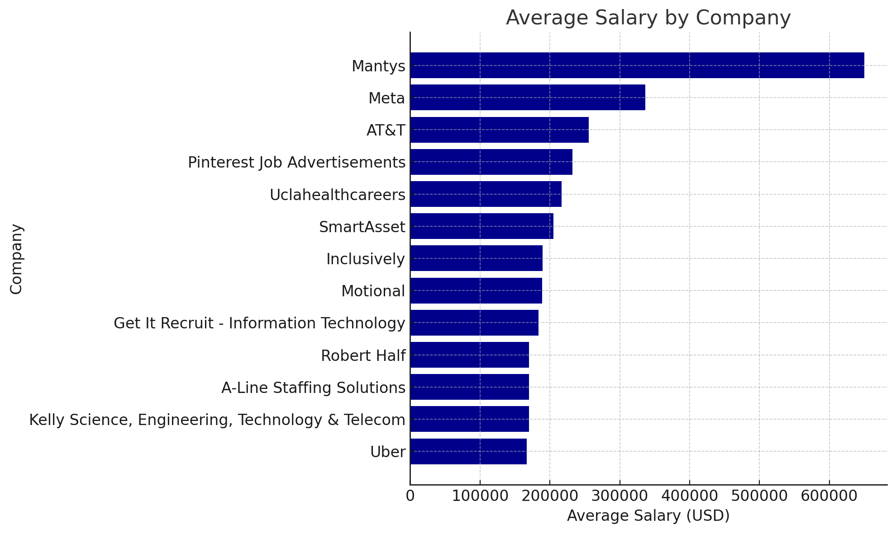
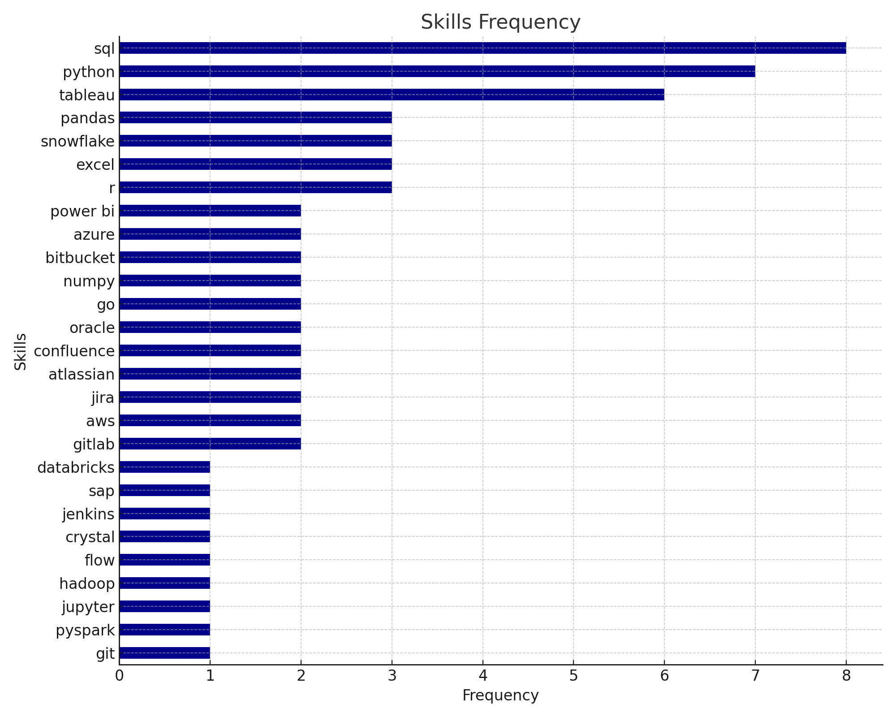

# Introduction 📊💻

This project is part of the SQL course by [Luke Barousse](https://github.com/lukebarousse) and [Kelly Adams](https://github.com/kellyadams), where we analyzed the job market for data-related roles, exploring various aspects such as salaries, required skills, locations, and more.

The course provides all the necessary knowledge, starting from the basics and progressing to more complex concepts like joins, CASE expressions, and Common Table Expressions (CTEs). Alongside SQL, it also offers valuable insights into using Git and VS Code for version control and project management.

Luke's clear and engaging teaching style makes learning SQL approachable and keeps you motivated to build your skills further.

For a detailed review of the queries, please check out [project_sql](/project_sql/) 📂.

# Background

In this project, we aim to answer the following key questions:

1. What are the top-paying data analyst jobs?
2. What skills are required for these top-paying jobs?
3. What skills are most in demand for data analysts?
4. Which skills are associated with higher salaries?
5. What are the most valuable skills to learn for maximizing career potential?

# Tools

+ SQL
+ Postgres SQL
+ Visual studio Code
+ Git & GitHub

# The Analysis

The following queries will focus exclusively on **Data Analyst** roles.

### 1. What are the top-paying roles for Data Analysts?

This query enables us to filter by company, salary, and location to identify the highest-paid Data Analyst positions.

```sql
SELECT
   job_id,
   name AS company_name,
   job_title,
   salary_year_avg,
   job_country

FROM job_postings_fact
LEFT JOIN company_dim ON job_postings_fact.company_id = company_dim.company_id
WHERE 
   salary_year_avg IS NOT NULL
   AND job_title_short = 'Data Analyst'
   AND job_location = 'Anywhere'
   
ORDER BY
   salary_year_avg DESC
LIMIT 10

```

- The salaries for Data Analyst roles in this dataset range from $165,000 to $650,000 per year.
- Job titles like Director of Analytics and Principal Data Analyst consistently rank among the highest-paying positions, with salaries often exceeding $200,000. 
- Major tech companies like Meta, Pinterest, and Uber are among the top employers offering competitive salaries for data-related roles. For instance, Meta offers $336,500 for a Director of Analytics, demonstrating that tech giants continue to be leaders in compensation for data professionals.



##### *Top average salaries by company - Chart generated by ChatGPT with the resulting query*


### 2. What skills are required for these top-paying jobs?

We can use the query from question 1 to create a CTE, which we can then join with the table containing the relevant skills.


```sql
WITH top_paying_jobs AS (
   SELECT
      job_id,
      name AS company_name,
      job_title,
      salary_year_avg

   FROM job_postings_fact
   LEFT JOIN company_dim ON job_postings_fact.company_id = company_dim.company_id
   WHERE 
      salary_year_avg IS NOT NULL
      AND job_title_short = 'Data Analyst'
      AND job_location = 'Anywhere'
      
   ORDER BY
      salary_year_avg DESC
   LIMIT 10
   )

SELECT 
   top_paying_jobs. *,
   skills
FROM top_paying_jobs
INNER JOIN skills_job_dim ON top_paying_jobs.job_id = skills_job_dim.job_id
INNER JOIN skills_dim ON skills_job_dim.skill_id = skills_dim.skill_id
ORDER BY
   salary_year_avg DESC
```
- SQL is the most frequently listed skill, highlighting its critical importance in data analysis roles across multiple job postings.
- Python and Tableau are also highly sought-after skills, reflecting their widespread use in data manipulation, analysis, and visualization.
- Other tools like Snowflake, Azure, AWS, and Pandas appear frequently, suggesting that cloud-based platforms and advanced data manipulation libraries are essential in more specialized data roles.


##### *Most required skills from the highest paying companies - Chart generated by ChatGPT with the resulting query*

### 3. What skills are most in demand for data analysts?

We this query we will find out the top 5 demanded skills for Data Analyst roles

```sql

SELECT
   skills,
   COUNT (job_postings_fact.job_id) AS num_jobs
FROM job_postings_fact
INNER JOIN skills_job_dim ON job_postings_fact.job_id = skills_job_dim.job_id
INNER JOIN skills_dim ON skills_job_dim.skill_id = skills_dim.skill_id

WHERE 
   job_title_short = 'Data Analyst'
   AND job_work_from_home = TRUE


GROUP BY skills
ORDER BY
   num_jobs DESC
LIMIT 5

```
- SQL is required in 7,291 job postings, making up 32.29% of the total. This underscores its critical role in data analysis.
- Excel (20.42%) and Python (19.17%) are also highly sought after, highlighting their importance alongside SQL in data analyst roles.


| Skills    | Number of Jobs |
|-----------|----------------|
| SQL       | 7,291          |
| Excel     | 4,611          |
| Python    | 4,330          |
| Tableau   | 3,745          |
| Power BI  | 2,609          |
##### *Table of the demand for the top 5 skills in data analyst job postings*


### 4. Which skills are associated with higher salaries?

Let´s explore what are skills with the highest average salaries

```sql
SELECT
   skills,
   ROUND (AVG(salary_year_avg), 0)AS average_salary
FROM job_postings_fact
INNER JOIN skills_job_dim ON job_postings_fact.job_id = skills_job_dim.job_id
INNER JOIN skills_dim ON skills_job_dim.skill_id = skills_dim.skill_id

WHERE
   salary_year_avg IS NOT NULL
   AND job_title_short = 'Data Analyst'
   AND job_work_from_home = TRUE

GROUP BY skills
ORDER BY
   average_salary DESC
LIMIT 10
```
- PySpark leads with $208,172, highlighting the value of big data expertise.
- itbucket and GitLab skills fetch high salaries, emphasizing the importance of DevOps and version control.
- Jupyter, Pandas, and Elasticsearch skills are well-compensated, reflecting their importance in data science.

| Skills        | Average Salary |
|---------------|----------------|
| PySpark       | $208,172       |
| Bitbucket     | $189,155       |
| Watson        | $160,515       |
| Couchbase     | $160,515       |
| DataRobot     | $155,486       |
| GitLab        | $154,500       |
| Swift         | $153,750       |
| Jupyter       | $152,777       |
| Pandas        | $151,821       |
| Elasticsearch | $145,000       |
##### *Table of the average salary for the top 10 paying skills for data analysts*
### 5. What are the Most Optimal Skills to Learn?

By combining our previous insights, we can identify the skills that are associated with both high salaries and strong demand.

```sql
SELECT
   skills_dim.skills,
   COUNT (job_postings_fact.job_id) AS num_jobs,
   ROUND (AVG (job_postings_fact.salary_year_avg),0) AS avg_salary
FROM job_postings_fact
INNER JOIN skills_job_dim ON skills_job_dim.job_id = job_postings_fact.job_id
INNER JOIN skills_dim ON skills_dim.skill_id = skills_job_dim.skill_id 
WHERE
   job_postings_fact.job_work_from_home = TRUE
   AND job_postings_fact.job_title_short = 'Data Analyst'
   AND job_postings_fact.salary_year_avg IS NOT NULL
GROUP BY
   skills_dim.skill_id
HAVING
   COUNT (job_postings_fact.job_id) > 10
ORDER BY
   avg_salary DESC,
   num_jobs DESC
LIMIT 15
```
- Python and R have the highest demand while still offering competitive salaries, indicating strong market value.
- Azure, and AWS offer high salaries and have strong demand, making cloud expertise a solid investment.
- Go ($115,320) and Confluence ($114,210) lead in pay, though their demand isn’t as high as other skills, making them niche yet highly rewarding expertise.


| Skills     | Number of Jobs | Average Salary |
|------------|----------------|----------------|
| Go         | 27             | $115,320       |
| Confluence | 11             | $114,210       |
| Hadoop     | 22             | $113,193       |
| Snowflake  | 37             | $112,948       |
| Azure      | 34             | $111,225       |
| BigQuery   | 13             | $109,654       |
| AWS        | 32             | $108,317       |
| Java       | 17             | $106,906       |
| SSIS       | 12             | $106,683       |
| Jira       | 20             | $104,918       |
| Oracle     | 37             | $104,534       |
| Looker     | 49             | $103,795       |
| NoSQL      | 13             | $101,414       |
| Python     | 236            | $101,397       |
| R          | 148            | $100,499       |
##### *Table of the most optimal skills sorted by salary*

# What I learned


# Conclusions
